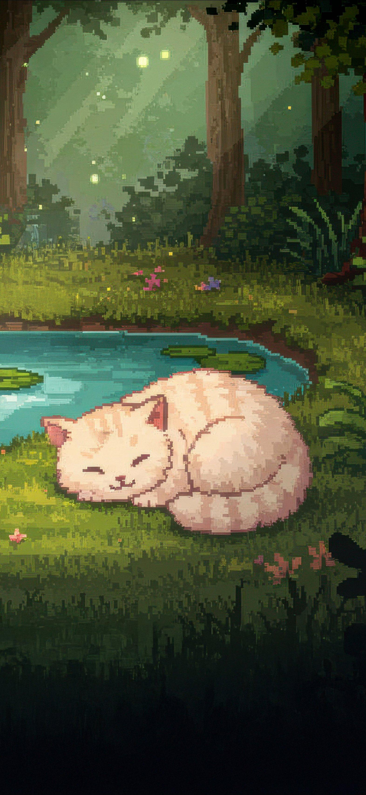
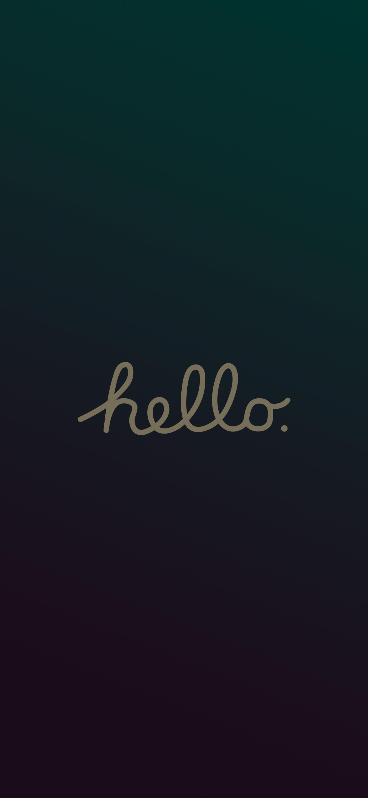

  
  

  <h1 align="center">Hi, I'm Soumya Singh</h1>
  
  

  

    <b>Machine Learning</b> • <b>Next.js</b> • <b>DevOps</b> • <b>STEM</b>
  

  

    
    
    
  

 

<h2 align="center">⚡ About Me</h2>

<table>
  <tr>
    <td width="40%" valign="top">
      
    </td>
    <td width="60%" valign="top">
      <h3>Web Developer & AI Enthusiast</h3>
      

        I'm an innovative <b>Web Developer</b>, <b>AI Enthusiast</b>, and Community Organizer. With a background in CSE and a deep understanding of computational methods, I specialize in <b>Next.js</b> based Web Development and open-source tools for impactful, equitable social change.
      

       
      

        🔭 Currently working on <b>High-quality web applications</b> 
        🌱 Currently learning <b>Machine Learning & DevOps</b> 
        👯 Looking to collaborate on <b>AI-integrated Web Projects</b> 
        💬 Ask me about <b>React, Next.js, and Data Mining</b>
      

    </td>
  </tr>
</table>

 

<h2 align="center">🚀 Technical Skills</h2>

  

  <table>
    <tr>
      <td valign="top" width="50%">
        <h3 align="center">Web Development</h3>
        

          REACT  
            
          NEXT.JS  
            
          TAILWIND CSS  
            
          NODE.JS  
            
        

      </td>
      <td valign="top" width="50%">
        <h3 align="center">Data & DevOps</h3>
        

          MONGODB  
            
          POSTGRESQL  
            
          REST API  
            
          WEB PERFORMANCE  
            
        

      </td>
    </tr>
  </table>

 

<h2 align="center">📊 GitHub Analytics</h2>

  
  
  

 

  

